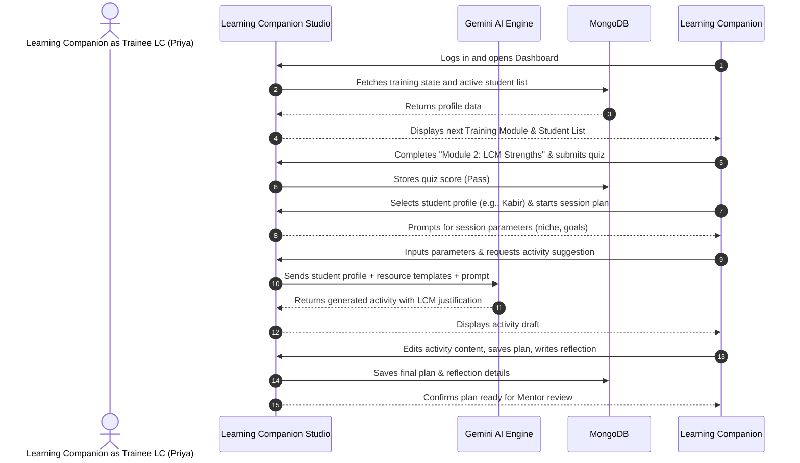
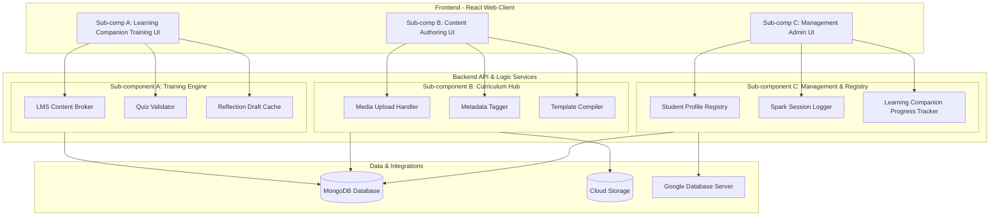
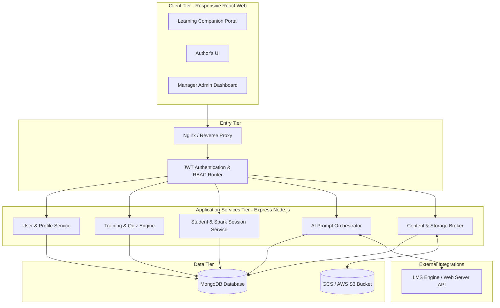

# High-Level Design (HLD) Document and Contract
> [!TIP]
> **Microsoft Word Format Available:** You can open/download the Word version here: [HLD_Document_and_Contract.docx](file:///Users/rushilbhat/Documents/Codex/2026-08-04/referenced-chatgpt-conversation-this-is-an/docs/HLD_Document_and_Contract.docx) (or find it in your project folder under `docs/`).

## Educational Application Development | ET 617

**Project Title:** Learning Companion Studio  
**Client:** InclusiveMinds Learning Collective (IMLC)  
**Project Lead:** Prof. Sridhar Iyer  
**Content Lead:** Farah (Curriculum Designer)  
**Student Team:** [Student Names & Roll Numbers]  
**Version:** 1.2  
**Date:** August 18, 2026  
**Document Status:** Revised (Human-Written Style)  

---

## 1. Project Information

| Item | Details |
| :--- | :--- |
| **Project Title** | Learning Companion Studio |
| **Client** | InclusiveMinds Learning Collective (IMLC) |
| **Client Contacts** | Prof. Sridhar Iyer (Project Lead), Farah (Content & Curriculum Lead) |
| **Student Team** | [Student 1 Name / Roll No], [Student 2 Name / Roll No], [Student 3 Name / Roll No], [Student 4 Name / Roll No] |
| **Primary Users** | Trainee Learning Companions, Qualified Learning Companions, Mentors/Program Coordinators |
| **Application Type** | Responsive Web Application |
| **Target Platform** | Web (Desktop, Tablet, Mobile-optimized) |
| **HLD Version** | 1.2 |
| **Date** | August 18, 2026 |

---

## 2. Project Overview

### 2.1 Problem Statement
InclusiveMinds Learning Collective (IMLC) helps neurodivergent kids aged 10-15 build career interests in specific niches like digital art, coding, or writing. Instead of following general school syllabi, they design custom 1-1 learning plans based on what each child is good at and what they like.

To do this, IMLC needs trained learning companions called Learning Companions (LCs) who understand the child and use the **IMLC Learning Companion Model (LCM)**. However, right now there are two main issues:
1. **Training Bottleneck:** Experienced mentors have to train new learning companions manually, one-by-one. Since there is currently only *one* fully qualified learning companion, IMLC cannot scale up to help more children.
2. **Heavy Preparation Time:** Designing custom activities for every kid is time-consuming. Learning Companions spend hours searching the web and filling out manual templates.

We need a system to help train new learning companions, keep track of their progress, and use AI to help them generate custom activity ideas based on child profiles, all while keeping IMLC's child-first philosophy.

### 2.2 Proposed Solution
Our solution is **Learning Companion Studio**, a responsive web app that helps train learning companions and lets them generate custom activities. The app has three main portals:

1. **Trainee Learning Companion Portal:** Learning Companions read about the LCM model (www.lcm-model.org), watch training clips, take quizzes to check their understanding, and write post-session reflections.
2. **Authoring Portal:** The Content Author (Aditi) uses this to upload worksheets, guides, and templates (*kya and kaise padhana hai*) and tag them.
3. **Mentor Dashboard:** Prof. Sridhar and other admins use this to track learning companion training progress, read their journal logs, approve lesson plans, and view student profiles.

To understand the child, the app tracks **3 Spark Sessions** run by the learning companion. The notes from these sessions create a student profile (interests, strengths, sensory triggers). The **LMS progress tracking module** then reads this profile, pulls templates uploaded by the Content Author, and suggests personalized lesson ideas with explanations of why they fit.

### 2.3 Project Objectives
* **Objective 1:** Build a web-based learning portal for trainee learning companions with training resources, quizzes, and reflection templates.
* **Objective 2:** Create an intake form to log the initial **3 Spark Sessions** and build a student profile.
* **Objective 3:** Implement an LMS lesson planner using the Database Server to recommend customized activities based on student tags and templates.
* **Objective 4:** Build an authoring page for the Content Author to upload assets and a dashboard for mentors to track learning companion progress.
* **Objective 5:** Ensure student data privacy by anonymizing profile fields.

### 2.4 Deployment Context
* **Intended Context:** Used internally by IMLC to train learning companions and plan lessons. Starting pilot in Mumbai, with plans to expand later.
* **Expected Users:** ~15-20 Trainee Learning Companions, 1-3 Mentors, and 50+ students (indirectly).
* **Technology Context:** Responsive web app (React + Node.js) deployed online. Learning Companions need internet for AI generation but can write reflection logs offline.

---

## 3. User Personas

### 3.1 Primary Persona: Trainee Learning Companion (Learning Companion)
* **Persona Name:** Priya Sharma  
* **Role:** Trainee Learning Companion (Learning Companion)  
* **Profile:** 23 years old. Doing her MA in Educational Psychology at St. Xavier's, Mumbai.  
* **Background & Knowledge:** Priya understands the theory of neurodiversity (like ADHD and autism) from her college lectures but hasn't done much actual classroom teaching. She is passionate about child-centric, strength-based coaching instead of traditional rote learning.  
* **Tech Comfort:** She uses normal mobile apps (Instagram, WhatsApp, Canva) daily but gets confused by complex professional software with nested menus. She prefers single-page forms and clean button layouts.  
* **Context:** Priya travels between her university classes and student sessions. She often plans lessons on her phone while traveling.  
* **Goals:**
  * Learn how to apply the LCM model in real sessions without reading dry academic textbooks.
  * Run the 3 Spark Sessions successfully to figure out a child's niche.
  * Plan fun, customized lessons in under 10 minutes.
* **Pain Points:**
  * Spends 3+ hours every night searching Google and Pinterest for activities that fit a visual learner.
  * Gets nervous before sessions because she can't easily get quick feedback from senior mentors.
  * Finding physical training sheets on handling specific behavioral triggers takes too long.
* **Motivations:** Wants to see neurodivergent kids find their passions and grow up to be financially independent.  
* **Constraints:** Very little prep time between college and fieldwork; needs short, mobile-friendly training units (10-15 mins).  
* **Success Metric:** Priya can set up an LCM-aligned activity plan on her phone and feel ready for her session in under 10 minutes.

---

### 3.2 Secondary Persona: Content Author
* **Persona Name:** Aditi Sen  
* **Role:** Lead Curriculum Designer & Content Creator  
* **Profile:** 38 years old. Former administrator at a special school with 12 years of curriculum design experience.  
* **Background & Knowledge:** Aditi knows the curriculum inside out. She knows exactly what and how to teach (*kya and kaise padhana hai*) for niches like digital art, basic coding, or writing.  
* **Tech Comfort:** Moderate. She uses MS Word, Google Sheets, and Google Forms easily but hates dealing with database settings, cloud storage permissions, or coding.  
* **Context:** Works from the IMLC office in Mumbai. She coordinates with industry volunteers to build curriculum resources and uploads them for the learning companions.  
* **Goals:**
  * Keep all training sheets, guides, and templates in one place.
  * Instantly send curriculum updates to all learning companions.
  * Tag resources correctly so the AI can find them when learning companions enter student interests.
* **Pain Points:**
  * Wastes hours emailing PDFs, sharing Google Drive folders, and fixing broken links.
  * Learning Companions sometimes use old worksheets because they can't find the new versions.
  * Doesn't know which of her templates are actually being used by learning companions.
* **Motivations:** Wants to make sure all learning companions maintain the same high standard of teaching.  
* **Constraints:** Extremely limited technical knowledge of database design, needs an interface that doesn't require coding.  
* **Success Metric:** Aditi can upload a guide, tag it (e.g., Coding, Visual, Age 10-12), and publish it to the repository in under 2 minutes.

---

### 3.3 Additional Persona: Program Mentor & Manager
* **Persona Name:** Prof. Sridhar Iyer  
* **Role:** Program Mentor & Manager  
* **Profile:** 52 years old. Senior Professor of Educational Technology at IIT Bombay.  
* **Background & Knowledge:** Designed the original Learning Companion Model. He has decades of research experience in active learning and teacher training.  
* **Tech Comfort:** High. He easily uses complex software, spreadsheets, and developer tools.  
* **Context:** Manages university classes and research while supervising IMLC. He reviews learning companion work late in the evening.  
* **Goals:**
  * Train 50+ learning companions within a year without getting overwhelmed.
  * Make sure all trainees follow the LCM guidelines.
  * Track and certify learning companion competencies easily.
* **Pain Points:**
  * Can't physically go to every learning companion's session to see how they are doing.
  * Reading learning companion journals and lesson drafts sent across WhatsApp groups is disorganized.
  * No central database to check student progress across the Spark Sessions.
* **Motivations:** Wants to scale personalized learning for neurodivergent kids across the country.  
* **Constraints:** Very busy; needs a quick dashboard that only highlights items needing attention (like pending activity reviews or failed quizzes).  
* **Success Metric:** Prof. Sridhar can log in, check a trainee's weekly quiz scores, read their reflection, and approve their certification in 5 minutes.

---

## 4. User Roles & Permissions

| Feature | Trainee Learning Companion | Content Author (Aditi) | Manager/Mentor (Prof. Sridhar) | Guest/Trainee applicant |
| :--- | :---: | :---: | :---: | :---: |
| **Self-Registration & Login** | ✓ | ✓ | ✓ | ✓ |
| **Access LCM Training Modules** | ✓ | ✓ | ✓ | View-Only |
| **Attempt Training Quizzes & Write Reflections** | ✓ | — | — | — |
| **Create & Update Student Profiles** | ✓ | — | ✓ | — |
| **Log 3 Spark Session Summaries** | ✓ | — | ✓ | — |
| **Generate & Edit AI Activities** | ✓ | — | ✓ | — |
| **Upload Curriculum Content & Templates** | — | ✓ | ✓ | — |
| **Review Learning Companion Progress & Approve Plans** | — | — | ✓ | — |
| **Export Learning Companion Analytics & Reports** | — | — | ✓ | — |

> [!NOTE]
> Trainee applicants must be manually approved by the Manager/Mentor before they gain full "Trainee Learning Companion" access and are matched with students.

---

## 5. User Journeys & Core Workflows

### 5.1 Primary User Journey: Learning Companion Training & Activity Design



#### Primary Workflow Description
The primary workflow begins when a trainee learning companion logs in to proceed with their training and session preparation. They first consume bitesize learning material about the LCM methodology and complete a knowledge check quiz. Once they pass, they are authorized to create lesson plans for their assigned students. To build a lesson plan, the learning companion accesses the LMS lesson planner, selects their student, and inputs the lesson objectives. The system combines the child's historical Spark Session profile (stored niche, strengths, and sensory triggers) with suitable templates uploaded by the Content Author. It sends this curated context to the LLM backend. The system then displays a fully fleshed-out activity draft containing instructions, materials needed, and an explanation of how it aligns with the child's learning profile. The learning companion edits the draft to include contextual tweaks, logs a pre-session reflection, and saves it. The plan is then queued for mentor verification.

---

### 5.2 Secondary User Journey: Content Upload & Tagging (Aditi)
1. **Login & Dashboard:** Aditi logs in and navigates to the "Authoring Panel".
2. **Initiate Upload:** She clicks "Upload Learning Asset".
3. **File Selection:** She drags and drops a PDF workbook and an instructional video.
4. **Metadata Specification:** She inputs key tags: Niche: *Digital Art*, Difficulty: *Intermediate*, Target Age Group: *12-15*, Learning Objectives: *Color Theory & Layers*, and aligns it to the *LCM Expression phase*.
5. **Publishing:** She clicks "Publish to Studio Repository".
6. **System Processing:** The system uploads the raw files to Cloud Storage, writes the metadata record to the database, and informs the AI generator that a new asset is available for suggestions.

---

### 5.3 Key Use Cases

* **UC-01: Log Spark Session Outcomes**
  * *User:* Trainee Learning Companion
  * *Description:* Learning Companion records findings from the 3 mandatory Spark sessions (child's reaction to coding tools, focus span, interest triggers, and sensory sensitivities).
  * *Expected Outcome:* System processes the inputs and updates the learner's profile, recommending "Web Design" or "Robotics" as a possible career niche.
* **UC-02: Generate AI Activity Plan**
  * *User:* Trainee Learning Companion
  * *Description:* Learning Companion requests a session plan for a learner.
  * *Expected Outcome:* The system generates an activity including setup steps, step-by-step guidance, scaffolding tips, and a text block justifying why the layout fits the child's profile.
* **UC-03: Review and Grade Learning Companion Progress**
  * *User:* Manager / Mentor
  * *Description:* Mentor accesses a trainee's portfolio to check training quiz scores, review designed activity logs, and read session reflections.
  * *Expected Outcome:* The mentor leaves feedback notes and checks a box to mark a training module as "Competency Certified".

---

## 6. 3-Part Project Breakdown & Functional Architecture

To make development clear and clean, the app is split into three main sub-components:



### 6.1 Sub-component A: Interactive Learning Companion Training Portal
This module handles all learning companion onboarding and training tasks.
* **LMS Content Broker:** Shows reading resources and training videos outlining the LCM model.
* **Quiz Validator:** Evaluates how learning companions do on knowledge check quizzes. Locks next modules until prerequisites are completed.
* **Reflection Draft Cache:** A markdown text editor where learning companions write pre-session and post-session reflections. Saves progress locally (browser local storage) so data isn't lost if the internet drops.

### 6.2 Sub-component B: Content Authoring & Curriculum Hub
This module lets the Content Author manage curriculum files and tag them for search.
* **Media Upload Handler:** Uploads PDFs, video lessons, and curriculum worksheets to our cloud storage.
* **Metadata Tagger:** Applies tags (age group, niche, strengths, learning style) to curriculum uploads.
* **Template Compiler:** Formats outline templates that are injected into the AI activity generator's prompt.

### 6.3 Sub-component C: Management & Monitoring System
This is the admin panel for mentors and the database of students.
* **Student Profile Registry:** Holds anonymized kid details, their interests, needs, and identified niche.
* **Spark Session Logger:** Tracks the first 3 sessions and prompts the learning companion to lock in a niche once all 3 are logged.
* **Learning Companion Progress Tracker:** Displays a progress grid of all trainees, their quiz marks, and journal feeds. Mentors can type inline feedback and certify the learning companion.
* **LMS Content Reader:** Connects to the Database Server, matching student tags and curriculum templates to generate lesson plans that can be exported as PDFs.

---

## 7. High-Level System Architecture

### 7.1 Architecture Diagram



### 7.2 Architecture Components

| Component | Purpose | Technology / Proposed Technology |
| :--- | :--- | :--- |
| **Frontend** | Renders dynamic dashboards and responsive views for mobile and desktop learning companions. | React, Vite, Tailwind CSS, Axios, Lucide React (icons) |
| **Backend** | Orchestrates business logic, user auth, database queries, and AI requests. | Node.js, Express, Mongoose, JWT (jsonwebtoken) |
| **Database** | Stores schema-flexible documents (learner details, logs, quizzes, activity plans). | MongoDB Atlas (Cloud Database) |
| **AI/ML** | Powers the core personalization engine by generating activities based on profiles. | LMS Engine / Web Server API (SDK: `@google/generative-ai`) |
| **Authentication** | Validates user identity and role scopes. | Simple username/password login session for secure password storage |
| **Storage** | Securely hosts curriculum PDFs, reference videos, and worksheets uploaded by the Content Author. | Google Cloud Storage or Amazon S3 |
| **Hosting** | Production deployment platform. | Vercel (Frontend), Render or Heroku (Backend API) |

### 7.3 External Services

| Service | Purpose | Dependency |
| :--- | :--- | :--- |
| **Google Database Server** | Contextualizing student profiles with curriculum guidelines to generate lesson plans. | **High** (App falls back to static template list if service goes offline) |
| **Google Cloud Storage** | Storing files uploaded by the Content Author. | **Medium** (Static text assets work, but file downloads fail if offline) |
| **SendGrid / SMTP Service** | Email alerts for learning companion approvals, quiz failure notifications, and mentor reminders. | **Low** (App functions normally; emails are processed in background queues) |

---

## 8. Data Architecture

### 8.1 Data Flow
```
[User Inputs Profile/Logs] ➔ [Express API Server] ➔ [MongoDB Collections] 
         ↓
  [Sent to Gemini AI] ➔ [Personalized Activity Plan Generated] ➔ [Stored to DB] ➔ [Output to Screen/PDF]
```

### 8.2 Key Data Entities

```mermaid
erDiagram
    USER {
        ObjectId id PK
        string email
        string passwordHash
        string role
        string name
        date createdAt
    }
    TUTOR-PROFILE {
        ObjectId id PK
        ObjectId userId FK
        array completedModules
        array quizScores
        array certifications
    }
    LEARNER-PROFILE {
        ObjectId id PK
        string initialName
        int age
        array sparkSessionLogs
        string identifiedNiche
        array strengths
        array interests
        array needs
        ObjectId assignedLearning CompanionId FK
    }
    ACTIVITY-PLAN {
        ObjectId id PK
        ObjectId learnerId FK
        string title
        string description
        string nicheArea
        string aiJustification
        string sessionSteps
        string materialsNeeded
        string learning companionReflection
        string status
        ObjectId createdByLearning CompanionId FK
    }
    LEARNING-RESOURCE {
        ObjectId id PK
        string title
        string fileUrl
        string resourceType
        array tags
        ObjectId uploadedBy FK
    }

    USER ||--|| TUTOR-PROFILE : "has"
    TUTOR-PROFILE ||--o{ LEARNER-PROFILE : "supervises"
    LEARNER-PROFILE ||--o{ ACTIVITY-PLAN : "uses"
    TUTOR-PROFILE ||--o{ ACTIVITY-PLAN : "designs"
    USER ||--o{ LEARNING-RESOURCE : "uploads"
```

### 8.3 Data Relationships
* A **Learning Companion** (User with Learning Companion role) is linked to a **Learning Companion Profile** storing their training state.
* A **Learning Companion** is assigned to multiple **Learners**.
* A **Learner Profile** has up to 3 **Spark Session logs** before their `identifiedNiche` is finalized.
* A **Learner Profile** is linked to multiple **Activity Plans** created over time.
* An **Activity Plan** is created by a **Learning Companion** and targeted to a **Learner**.
* **Learning Resources** uploaded by an **Author** are tagged and referenceable in Activity Plans.

### 8.4 Data Storage
* **Data Stored:** User accounts, learning companion progress metrics, anonymized student characteristics, AI activity logs, worksheet file URLs, and configuration settings.
* **Data NOT Stored:** Parent full names, full residential addresses, payment credentials, or live video/audio recordings of student sessions (to protect privacy and reduce hosting cost).
* **Storage Location:** MongoDB Atlas cloud database cluster (AWS Mumbai Region). Media files are hosted on Google Cloud Storage buckets.
* **Retention:** Active learning companion and student records are maintained indefinitely. Inactive accounts and associated logs are archived after 2 years and deleted after 5 years, unless requested earlier by administrators or parents.

---

## 9. UI/UX Architecture

### 9.1 Screen Inventory

| Screen | Main User | Purpose |
| :--- | :--- | :--- |
| **Login / Sign In** | All Users | Authenticate and route user to their respective dashboard interface. |
| **Learning Companion Dashboard** | Trainee Learning Companion | View training roadmap, jump to next lesson, see assigned students, and check session calendar. |
| **Training Module Viewer** | Trainee Learning Companion | Read training material, view video guides, take quizzes, and write reflections. |
| **Learner Profile Details** | Trainee Learning Companion | View child details, input Spark Session notes, and monitor overall learning pathway progress. |
| **Lesson Planner** | Trainee Learning Companion | Form interface to generate lesson content via LLM and refine the plan in a text editor. |
| **Authoring Console** | Aditi (Author) | Manage global library of learning resources, upload files, and set up templates. |
| **Managing Dashboard** | Prof. Sridhar | High-level tracking of all trainee learning companions, review queue for activity plans, and learning companion profile detail views. |

### 9.2 Navigation Structure
```
[Welcome Screen / Login]
  ├── Trainee Learning Companion ➔ [Learning Companion Dashboard]
  │                      ├── [LCM Training Module] ➔ [Attempt Quiz & Reflection]
  │                      └── [Learner Profile] ➔ [Spark Session Logger] ➔ [Lesson Planner] ➔ [Export Plan]
  │
  ├── Content Author ➔ [Author Dashboard]
  │                      ├── [Upload Asset Form]
  │                      └── [Manage Curriculum Catalog]
  │
  └── Program Manager ➔ [Manager Dashboard]
                         ├── [Learning Companion Progress Grid] ➔ [Reflective Log Review]
                         └── [System Usage Reports]
```

### 9.3 Wireframe Descriptions

#### Screen 1: Lesson Planner (Learning Companion View)
```
+-----------------------------------------------------------------------------+
|  [Learning Companion Studio]                  Priya (Learning Companion) | Logout  |
+-----------------------------------------------------------------------------+
|  < Back to Learner Profile (Kabir)                                          |
|                                                                             |
|  AI ACTIVITY GENERATOR                                                      |
|  +-------------------------------------+  +-------------------------------+ |
|  | Input Parameters                    |  | Generated Lesson Plan (Draft) | |
|  | Student: Kabir (Age: 12)            |  | Title: Intro to Python Turtles| |
|  | Niche: Coding                       |  | Niche: Coding (Game design)   | |
|  | Interests: Space, Rocketry          |  |                               | |
|  | Strengths: Visual learner, Logic    |  | Activity Steps:               | |
|  | Sensory Needs: Avoids loud noises   |  | 1. Open IDE (Dark mode)       | |
|  |                                     |  | 2. Draw a star using Turtles  | |
|  | Session Goal:                       |  |                               | |
|  | [ Introduce loops & coordinates   ] |  | LCM Pedagogical Reason:       | |
|  |                                     |  | Leverages Kabir's passion for | |
|  | Reference Resource:                 |  | Space to explain coordinates. | |
|  | [ Python Basics Unit 1 (Aditi) v]   |  | Provides high visual feedback | |
|  |                                     |  | to fit visual strength.       | |
|  | [   GENERATE ACTIVITY WITH AI   ]   |  |                               | |
|  +-------------------------------------+  +-------------------------------+ |
|                                           | [ Edit Draft ]   [ Export PDF ] | |
|                                           +-------------------------------+ |
+-----------------------------------------------------------------------------+
```

#### Screen 2: Managing Dashboard (Mentor View)
```
+-----------------------------------------------------------------------------+
|  [Learning Companion Studio]             Prof. Sridhar (Manager) | Logout   |
+-----------------------------------------------------------------------------+
|  TRAINEE TUTOR MONITORING PANEL                                             |
|  +-----------------------------------------------------------------------+  |
|  | Search Learning Companions: [ Search...       ]       Filter: [ Pending Review v ] |  |
|  +-----------------------------------------------------------------------+  |
|  | Name      | Training Progress | Quizzes Passed | Pending Activity Plans|  |
|  +-----------+-------------------+----------------+------------------------+  |
|  | Priya S.  | [=======>    ] 60%| 4 / 6          | 2 Plans (Review Now)   |  |
|  | Amit K.   | [=========>  ] 80%| 5 / 6          | 0 Plans                |  |
|  | Rohan M.  | [=>          ] 15%| 1 / 6          | 1 Plan (Review Now)    |  |
|  +-----------+-------------------+----------------+------------------------+  |
|                                                                             |
|  RECENT TUTOR JOURNAL ENTRIES                                               |
|  +------------------------------------------------------------------------+ |
|  | Priya S. (Aug 14): "Kabir stayed focused when building the spaceship..."| |
|  | [ Read full reflection & add feedback note ]                            | |
|  +------------------------------------------------------------------------+ |
+-----------------------------------------------------------------------------+
```

---

## 10. Technology Stack

### 10.1 Frontend
* **Platform:** Web (responsive interface accommodating mobile phones and desktops).
* **Framework:** React 18, scaffolded with Vite for modern asset bundling and rapid hot reloading.
* **Language:** JavaScript (ES6+).
* **Styling:** Tailwind CSS for design utility classes and consistent responsive layouts.

### 10.2 Backend
* **Framework:** Node.js with Express (REST API).
* **Language:** JavaScript.
* **API Architecture:** RESTful APIs using standard JSON response structures. Endpoint mapping is structured by module scope (e.g., `/api/auth`, `/api/training`, `/api/students`, `/api/activities`).

### 10.3 Database
* **Database engine:** MongoDB (flexible document database).
* **Purpose:** Stores schemas that evolve easily as learner profiles adapt.
* **Object Mapping:** Mongoose.

### 10.4 AI / ML Components
* **Model/Service:** LMS Engine / Web Server (via the `@google/generative-ai` SDK).
* **Purpose:**
  1. *Activity Generator:* Takes structured student data and creates lesson plans.
  2. *Reflective Assistant:* Analyzes learning companion session journals to highlight key teaching moments for mentors.
* **Inference:** Cloud-based API.
* **External API:** Yes (requires `GEMINI_API_KEY` stored in server environment).
* **Fallback Mechanism:** If the Database Server experiences an outage, the system switches to a repository of pre-written activity sheets uploaded by the Content Author, matching the tagged niche automatically without AI customization.

### 10.5 Infrastructure
* **Hosting:** Frontend hosted on Vercel; Backend API hosted on Render/Heroku.
* **Deployment Pipeline:** Automated GitHub actions run unit tests and deploy on commits to the `main` branch.
* **Version Control:** GitHub.

---

## 11. Non-Functional Requirements

### 11.1 Performance
* **Response Time:** Standard CRUD endpoints (fetch training resources, log Spark sessions) must respond in `< 200ms`. AI activity generation must complete in under `5 seconds` under normal network conditions.
* **Maximum Concurrent Users:** Built to support up to `100` concurrent active learning companions and managers without degradation.
* **Content Processing Time:** File uploads (up to 50MB) must process and write to Cloud Storage in under `15 seconds`.

### 11.2 Accessibility
* **Standard:** Compliance with WCAG 2.1 Level AA guidelines.
* **Keyboard Access:** All forms, dashboard buttons, and navigation nodes must be completely accessible via keyboard tab controls.
* **Screen Readers:** Semantic HTML markup to allow screen readers (VoiceOver, NVDA) to decode the user interface correctly.
* **Colour Contrast:** Text-to-background contrast ratio must be at least `4.5:1` to prevent eye strain.

### 11.3 Security
* **Authentication:** Session login with cookie validation to prevent Cross-Site Scripting (XSS) leaks.
* **Authorization:** Simple role-based check checked at the router gateway level for both frontend views and backend API routes.
* **Data Protection:** Hashing of user passwords using `bcrypt` (work factor 10). Encryption of data in transit via TLS 1.3 (HTTPS).
* **Secure Communication:** Database connections secured within VPC environments or IP white-listing.

### 11.4 Privacy
* **Personally Identifiable Information (PII):** Learning Companions and managers log in with emails. Students are represented by anonymized initials or codes (e.g., "Kabir S." stored as "K.S.").
* **Student Data Collection:** Only educational and behavioral properties relevant to the learning pathway are captured. No medical diagnoses or parent-confidential information is stored.
* **Data Anonymization:** Data sent to the Database Server is stripped of name tokens. The prompt utilizes only age, strengths, interests, and needs tags.
* **Data Sharing:** Data is not shared with third parties. No commercial ad-tracking cookies are present.
* **Third-Party AI Data Processing:** The enterprise Database Server agreement must verify that input prompt text is not used to train Google's public base models.

### 11.5 Compatibility
* **Supported Devices:** Web browsers on iPhones, Android phones, iPads, Android tablets, and Windows/Mac Laptops.
* **Supported Browsers:** Google Chrome (v100+), Safari (v15+), Mozilla Firefox (v100+), and Microsoft Edge.

### 11.6 Offline Requirements
* **Offline Functionality:** Learning Companions working in environments with weak connectivity must be able to:
  * Read training modules that were already opened (cached locally using Service Worker).
  * Write session reflections draft locally, which will sync automatically to the cloud database when internet access is restored.

---

## 12. Assumptions & Constraints

### 12.1 Assumptions
1. **Curriculum Availability:** The Content Author will provide the baseline templates and guidelines (*kya and kaise padhana hai*) prior to the start of database schema implementation.
2. **Stable Internet for AI:** Learning Companions will have an active internet connection when using the AI activity generator during lesson planning.
3. **Apprentice Base:** Trainee learning companions have basic digital familiarity and are capable of navigating modern web layouts.

### 12.2 Constraints
1. **Limited Feedback Loop:** With only one qualified learning companion currently at IMLC, testing sessions and expert review slots will be constrained by their availability.
2. **Budget Limitations:** Development must be completed using free/low-cost resource tiers (MongoDB Atlas Free Tier, Database Server free credits, Render free instance).
3. **Fixed Deadline:** The prototype must be ready for presentation by early November 2026 (ET 617 timeline).

---

## 13. Project Scope

### 13.1 In Scope
* User account registration, login, and dashboard views (Learning Companion, Content Author, Manager).
* Modular training reading cards, videos integration, interactive quizzes, and reflection entry forms.
* Student profile builder containing the 3-step Spark Session survey log.
* LLM-driven Activity Generator that pulls student data and returns custom lessons.
* Simple WYSIWYG editor to adjust generated lessons.
* Author control dashboard for the Content Author to upload resources and tag metadata.
* Manager dashboard for Prof. Sridhar to view trainee stats, quiz results, and reflections.
* PDF output engine to export generated plans for offline print.

### 13.2 Out of Scope
* Real-time videoconferencing tool inside the application (external platforms like Google Meet or Zoom are utilized).
* Automatic grading of essay-style learning companion reflections (graded manually by Mentors; AI only identifies sentiment and keywords).
* Student-facing log-ins (all activities are administered and viewed by the learning companions).
* Direct integration with school administrative systems (SIS).

---

## 14. Acceptance Criteria

The system will be considered functionally complete when:

### Core Functionality
* Users can sign up, log in, and see menus corresponding only to their role permissions.
* Trainee learning companions can access training modules, complete quizzes, and submit reflections.
* A learning companion can successfully log 3 Spark Sessions, generating a completed student profile.
* The Activity Generator receives student tags and displays an editable activity suggestion in `< 8 seconds` with zero formatting errors.
* The Content Author can upload a PDF guide, and it is instantly indexed and tag-searchable.
* Prof. Sridhar can view learning companion quiz metrics and add comments to learning companion reflection journals.

### User Experience
* Mobile layouts do not clip text or break grids down to 320px screen width.
* System displays loading indicators during AI generation and file uploads.
* Intuitive flow with a navigation panel that operates in `< 3 clicks` between screens.

### Technical
* The backend code passes basic linting and error-free builds.
* API secrets (database credentials, API keys) are managed through environment variables and never exposed in the source code.
* Security test validates that a user logged in as a "Learning Companion" is blocked from executing Author or Manager API calls.

### Deployment
* The app is deployed on public URLs (Vercel/Render) and accessible by the client for testing.

---

## 15. Development Dependencies

| Dependency | Required From | Required By | Status |
| :--- | :--- | :--- | :--- |
| **LCM Training Materials** | Client (IMLC / Farah) | Week 3 (August 22, 2026) | **Pending** |
| **Sample Learner Data & Tags** | Client (IMLC) | Week 4 (August 25, 2026) | **Pending** |
| **Database Server Key Access** | Development Team | Week 4 (August 25, 2026) | **In Progress** |
| **Activity Templates (*Kya/Kaise*)**| Client (Farah) | Week 6 (September 6, 2026) | **Pending** |
| **Production Credentials** | Client (Prof. Sridhar) | Week 11 (October 19, 2026) | **Pending** |

---

## 16. Open Questions & Decision Log

| ID | Question / Decision | Decision | Owner | Date |
| :--- | :---: | :--- | :---: | :---: |
| **D-01** | What LLM provider should we use for activity generation? | Decided to use **LMS Engine / Web Server** due to its low cost, large context window, and ease of deployment. | Student Team | Aug 12, 2026 |
| **D-02** | How detailed should child profile listings be? | **Decided:** Anonymize completely. Only store initials, age, and tag-based characteristics. No real names or diagnostic history. | Client Lead | Aug 14, 2026 |
| **D-03** | Do we need support for offline usage? | **Decided:** Learning Companions will write session reflections offline; the client app caches drafts locally and syncs on next internet heartbeat. | Student Team | Aug 14, 2026 |

---

## 17. Project & HLD Agreement

### 17.1 Agreement on HLD
Both parties agree that:
* The High-Level Design (HLD) Document represents the current agreed understanding of the project.
* The HLD defines the intended users, user journeys, core functionality, system architecture, technology approach, scope, assumptions, constraints, and acceptance criteria.
* The Student Team will use the approved HLD as the basis for designing and developing the application.
* The Client will review the HLD and provide feedback or approval within the agreed project schedule.
* Any significant change to the agreed scope or functionality will be discussed between the Student Team and Client before implementation.

### 17.2 Agreement on Deliverables and Timeline
The Student Team agrees to work towards completing the project deliverables within the agreed project timeline.
The Student Team will complete milestone tasks, present them for feedback, incorporate reasonable suggestions, and deliver the final source code and documentation.

The Client agrees to provide necessary training content, sample tags, review deliverables promptly, and communicate any requirement adjustments.

### 17.3 Timeline Dependencies
The agreed development timeline is dependent on the timely participation and feedback of both parties. If required information, content, or feedback is delayed, the corresponding development milestone may need to be revised.

### 17.4 Final Deliverables, Timeline, and Specific Test Cases

To meet strict academic standards, the project roadmap includes clear deliverables linked directly to verifyable test cases that will be demonstrated to the client upon completion of each milestone.

#### Milestone 1: Weeks 4–6 (August 23 – September 6)
* **Exact Deliverables:**
  1. MongoDB schemas mapping User collection, Learning Companion Profile collection, Learner Profile collection, and Spark Session array structures.
  2. Node.js/Express backend server with JSON Web Token (JWT) authentication and role-based access control (RBAC) middleware.
  3. Responsive client-side routing matching role views (Learning Companion, Author, Manager).
* **Verification Test Cases:**
  * **TC-1.1 (Security):** Log in as a trainee companion. Send a `GET` request directly to the admin endpoint `/api/admin/learning companion-analytics`. Verify the server rejects the request with status code `403 Forbidden` and returns `{"error": "Unauthorized role access"}`.
  * **TC-1.2 (Privacy):** Send a `POST` request to `/api/students/profile` containing field `"fullName": "Kabir Sharma"`. Verify the server validation intercepts, rejects with `400 Bad Request`, and forces compliance with anonymization regulations (requiring initials/codes only).
  * **TC-1.3 (Discovery Trigger):** Write 3 Spark session log documents to a new student document via `/api/students/:id/spark`. Verify that upon saving the third record, the student's phase attribute automatically transitions from `"Discovery"` to `"Niche Identified"`, unlocking the activity planner view.

#### Milestone 2: Weeks 7–10 (September 7 – October 18)
* **Exact Deliverables:**
  1. LMS Module reader interface integrating video components and multi-format quizzes.
  2. Local-first markdown reflection journal editor caching input drafts to local storage.
  3. AI-powered Activity Generator executing structured Database Server prompts utilizing tags and templates.
  4. Edit layout for final activity sheets and a print-to-PDF export handler.
* **Verification Test Cases:**
  * **TC-2.1 (Offline Cache):** Load the reflection journal editor. Disable network connectivity. Write a post-session journal reflection and click "Save Draft". Verify the page confirms the draft is written to browser local storage. Re-establish connection; verify the service worker syncs the draft to the database backend automatically.
  * **TC-2.2 (API Fallback):** Set the Database Server connection string to a dummy/invalid URL (simulating service outage). Request an activity plan generation for a student interested in "Digital Art". Verify the system does not crash, displays a warning toast, and returns a pre-configured static "Digital Art Basics" layout.
  * **TC-2.3 (Prerequisite Lock):** Attempt to call the Module 3 quiz API `/api/training/quiz/3` before the user profile has marked Module 2 quiz as `"Passed"`. Verify the backend returns `400 Bad Request` with message `{"error": "Complete prior modules before attempting quiz"}`.

#### Milestone 3: Week 11 (October 19 – October 23)
* **Exact Deliverables:**
  1. Author Dashboard layout letting the Content Author upload curriculum PDFs, drag-and-drop assets, and assign metadata tags.
  2. Manager progress dashboard with a datagrid showing trainee quiz marks, certification status check-boxes, and trainee reflection feeds.
* **Verification Test Cases:**
  * **TC-3.1 (Upload Handling):** Upload a 48MB curriculum PDF file through the Author's panel. Verify that the client renders a progress percentage indicator, uploads the asset to Cloud Storage, and inserts the document metadata into MongoDB in `< 15 seconds`.
  * **TC-3.2 (Feedback Loop):** Log in as Prof. Sridhar (Manager). Post a review comment on Priya's (Learning Companion) journal entry for a session. Log in as Priya; verify that a notification alert is flagged in the navigation header and the comment is readable on her dashboard.

#### Milestone 4: Week 13 (October 26 – November 6)
* **Exact Deliverables:**
  1. Completely styled responsive web layout tested across multiple screen resolutions.
  2. Final deployed client application on Vercel and API backend on Render/Heroku.
  3. Completed user acceptance testing (UAT) report signed by IMLC stakeholders.
* **Verification Test Cases:**
  * **TC-4.1 (Responsive UI):** Render the Learning Companion portal on a simulated mobile viewport (320px width). Ensure that the top header collapses into a hamburger icon and all forms, input fields, and grids are stacked vertically without screen clipping.
  * **TC-4.2 (Load test):** Run a benchmark test sending 100 concurrent mock API calls to the student directory `/api/students`. Verify that the backend maintains response times below `200ms` and does not drop any connections.

---

### 17.5 Mutual Confirmation

By signing below, both parties confirm that they have reviewed and discussed the project requirements and High-Level Design (HLD), agree to use the approved HLD as the basis for development, and commit to working collaboratively towards completing the agreed deliverables within the project timeline.

#### Signatures

**Student Team:**
* Student 1 Name: _______________________ Signature: _______________________ Date: _________
* Student 2 Name: _______________________ Signature: _______________________ Date: _________
* Student 3 Name: _______________________ Signature: _______________________ Date: _________
* Student 4 Name: _______________________ Signature: _______________________ Date: _________

**Client (InclusiveMinds Learning Collective):**
* Client Lead Name: ______________________ Signature: _______________________ Date: _________
* Client Title: ___________________________

**HLD Approval:**
* HLD Document Version: **1.2 (Revised)**
* HLD Approval Date: ______________________
